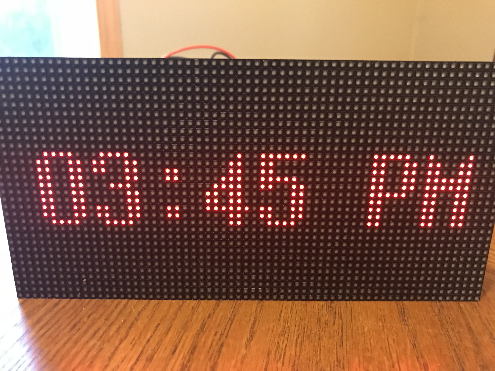

# Smart LED Clock

Smart LED clock


\* This picture will be updated through the progression of the project.  ( [See Goals Section](#goals-and-status) )

## How to install

Login to your Raspberry Pi and stay in the home directory.

``` shell
git clone https://github.com/bennysp/smartledclock.git
cd smartledclock
chmod 755 install_smartledclock.sh
./install_smartledclock.sh
```

If everything worked, then you should see a clock displayed on your LED panel!

## Starting and Stopping

Setup installs to **systemd**.  It will startup/shutdown via the OS reboots.  If you want to startup and shutdown outside of the OS, you can use the standard commands.

``` shell
sudo systemctl start smartledclock.service
sudo systemctl stop smartledclock.service
sudo systemctl status smartledclock.service
sudo systemctl restart smartledclock.service
```

## Hardware used

- Raspberry Pi 2 B - [Amazon Link](https://www.amazon.com/Raspberry-Pi-Model-Desktop-Linux/dp/B00T2U7R7I)
- Adafruit RGB HAT - [Amazon Link](https://www.amazon.com/Adafruit-RGB-Matrix-HAT-Raspberry/dp/B00SK69C6E/ref=sr_1_5?s=electronics&ie=UTF8&qid=1513801675&sr=1-5&keywords=adafruit+hat)
- 64x32 RGB LED Matrix - 3mm pitch  - [Adafruit Link](https://www.adafruit.com/product/2279)
- 5v 10amp Power Supply - [Amazon Link](https://smile.amazon.com/gp/product/B01M0KLECZ/ref=oh_aui_detailpage_o00_s00?ie=UTF8&psc=1)

Test
\*Note at the time of this writing, I am only using the standard power supply for the Pi.  This is enough to power the Pi and LED display  with the standard red text, but probably won't work for white.

## Development Language

- Uses C language - I am not very experienced in this language, but giving the performance concerns that have been listed with the library on Raspberr Pi, I am trying to continue the use of C.
- One very small shell script for calling clock functions and options.

### Libraries

- Raspberry Pi RGB Matrix library - [https://github.com/hzeller/rpi-rgb-led-matrix](https://github.com/hzeller/rpi-rgb-led-matrix)

## Goals and Status

1. ~~Display a simple clock on startup~~ **COMPLETE**
1. Create layouts for placement
1. Create first app - weather?
1. Incorporate connections to [IFTTT](https://ifttt.com/)
1. Webserver for admin and management

### Optional Goals

1. Mobile app

## Thanks and contributions

Original code started from the clock example in hzeller's repository.
[https://github.com/hzeller/rpi-rgb-led-matrix](https://github.com/hzeller/rpi-rgb-led-matrix)
